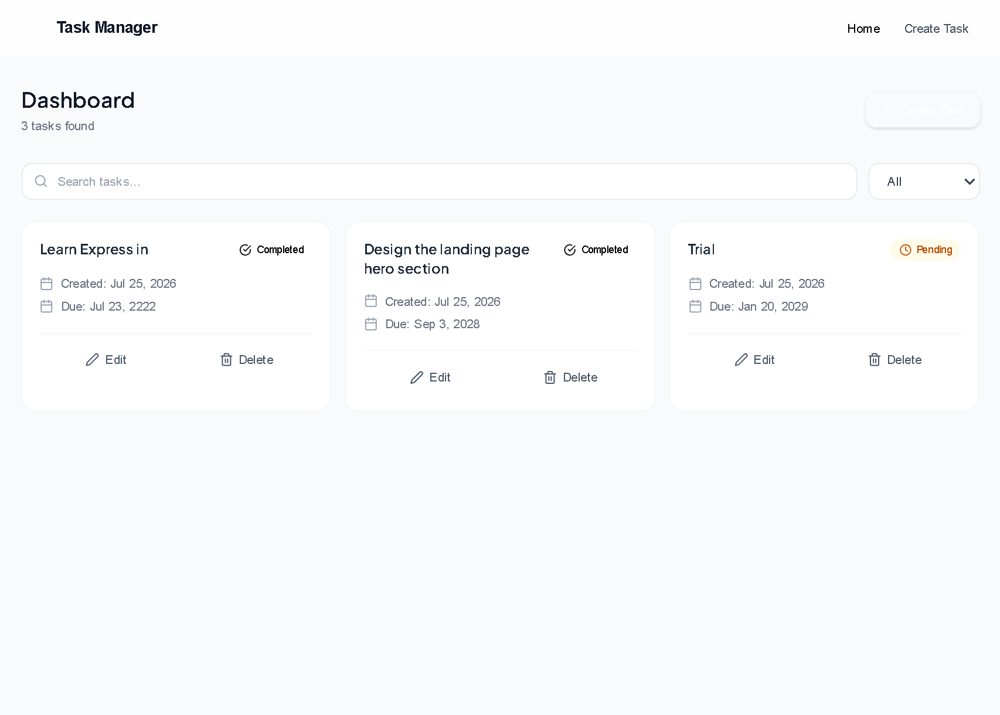
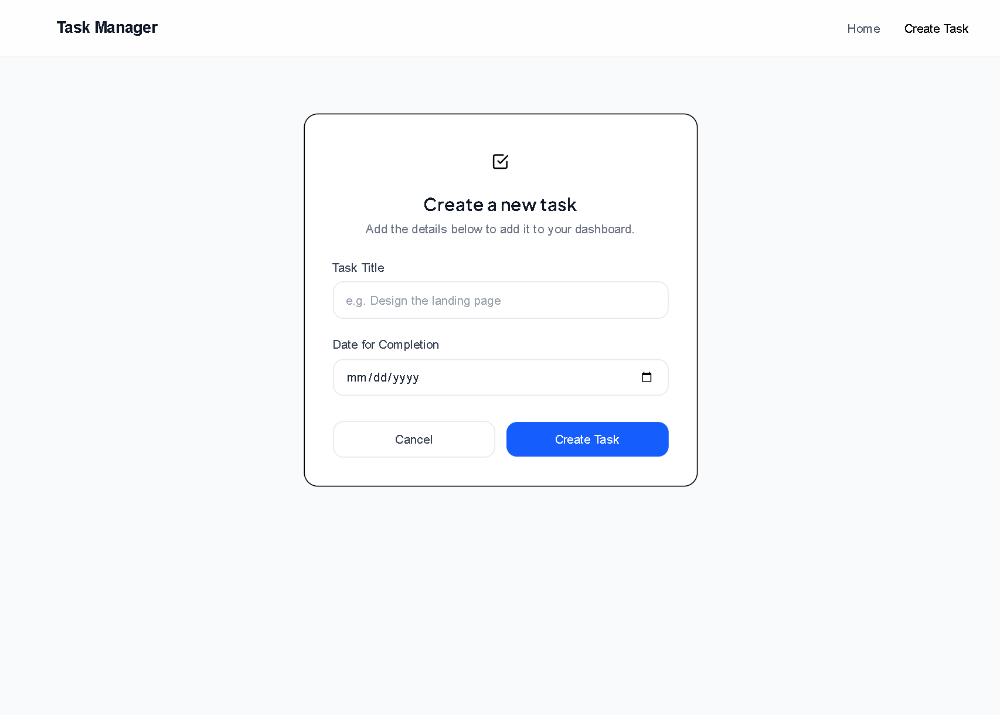
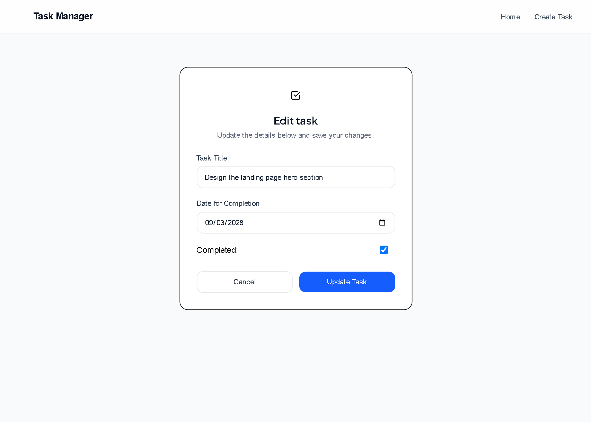
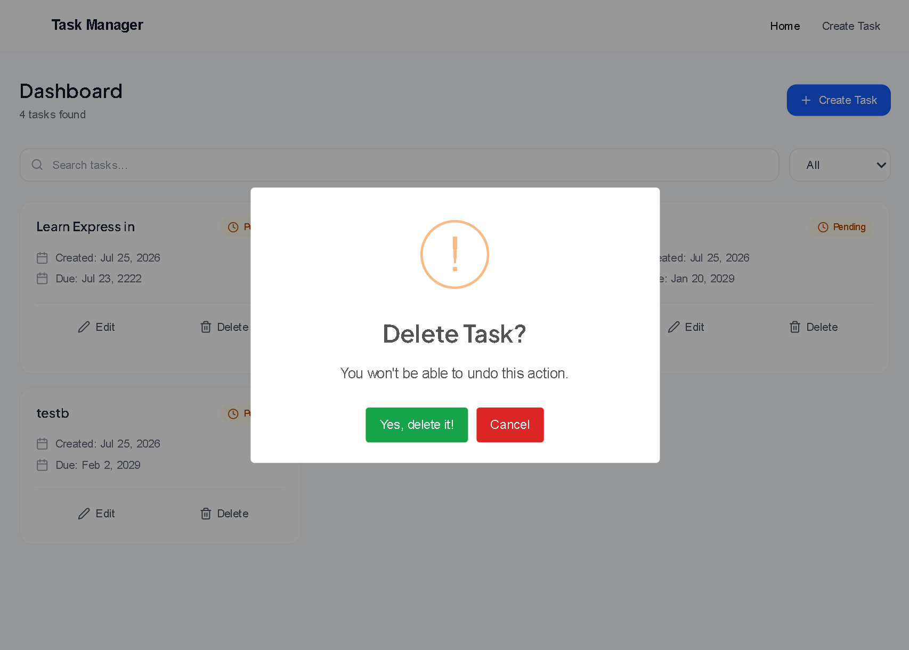

# 📝 Task Manager

A modern full-stack Task Manager application built with **React**, **Node.js**, **Express.js**, and **MongoDB**.

This application allows users to create, view, update, and delete tasks through a clean, responsive user interface while persisting data in MongoDB.

---

## ✨ Features

- ✅ Create new tasks
- 📋 View all tasks
- 🔍 View a single task
- ✏️ Update existing tasks
- 🗑️ Delete tasks with confirmation
- ✔ Mark tasks as completed
- ⏳ Loading spinner while fetching data
- 🔔 SweetAlert2 success and error notifications
- 📅 Due date support
- 🛡 Backend validation and error handling
- 💾 MongoDB data persistence

---

# 📸 Screenshots

## Dashboard



---

## Create Task



---

## Edit Task



---

## Delete Confirmation



---

# 🛠 Tech Stack

## Frontend

- React
- React Router DOM
- Axios
- Tailwind CSS
- SweetAlert2
- React Icons

## Backend

- Node.js
- Express.js
- MongoDB
- Mongoose
- dotenv
- CORS

---

# 📂 Folder Structure

```
Task-Manager
│
├── client
│   ├── src
│   │   ├── api
│   │   ├── assets
│   │   ├── components
│   │   ├── pages
│   │   ├── App.jsx
│   │   └── main.jsx
│   │
│   └── package.json
│
├── server
│   ├── config
│   ├── controllers
│   ├── middleware
│   ├── models
│   ├── routes
│   ├── app.js
│   └── package.json
│
├── screenshots
│
└── README.md
```

---

# ⚙ Installation

## Clone the repository

```bash
git clone https://github.com/Chrisdanvic1/task-manager.git
```

---

## Backend Setup

Navigate into the backend folder.

```bash
cd server
```

Install dependencies.

```bash
npm install
```

Create a `.env` file.

```env
PORT=5500
MONGO_URI=your_mongodb_connection_string
```

Start the backend server.

```bash
npm run dev
```

---

## Frontend Setup

Navigate into the frontend folder.

```bash
cd client
```

Install dependencies.

```bash
npm install
```

Start the React application.

```bash
npm run dev
```

---

# 🌐 API Endpoints

| Method | Endpoint            | Description    |
| ------ | ------------------- | -------------- |
| GET    | `/api/v1/tasks`     | Get all tasks  |
| GET    | `/api/v1/tasks/:id` | Get task by ID |
| POST   | `/api/v1/tasks`     | Create task    |
| PATCH  | `/api/v1/tasks/:id` | Update task    |
| DELETE | `/api/v1/tasks/:id` | Delete task    |

---

# 🗄 Database Schema

```javascript
{
    title: String,
    completed: Boolean,
    dateCreated: Date,
    dateForCompletion: Date
}
```

---

# 🧠 What I Learned

Building this project helped me strengthen my understanding of:

- REST API development
- Express routing
- MongoDB CRUD operations
- Mongoose models and schemas
- React Hooks
- React Router
- Axios
- State management
- Component reusability
- Form handling
- Loading states
- SweetAlert2
- Connecting a React frontend to an Express backend
- Error handling and validation

---

# 🚀 Future Improvements

- Authentication (JWT)
- Search tasks
- Filter tasks
- Pagination
- Sorting
- Dark mode
- Better mobile responsiveness
- Deployment

---

# 👨‍💻 Author

**Obimma Victor**

GitHub

https://github.com/Chrisdanvic1

LinkedIn

(Add your LinkedIn URL)

Portfolio

(Add your Portfolio URL)

---

# 🤝 Contributing

Contributions are welcome.

1. Fork the repository
2. Create your feature branch

```bash
git checkout -b feature/new-feature
```

3. Commit your changes

```bash
git commit -m "Add new feature"
```

4. Push the branch

```bash
git push origin feature/new-feature
```

5. Open a Pull Request

---

# 📄 License

This project is licensed under the MIT License.

Feel free to use, modify, and distribute it.
